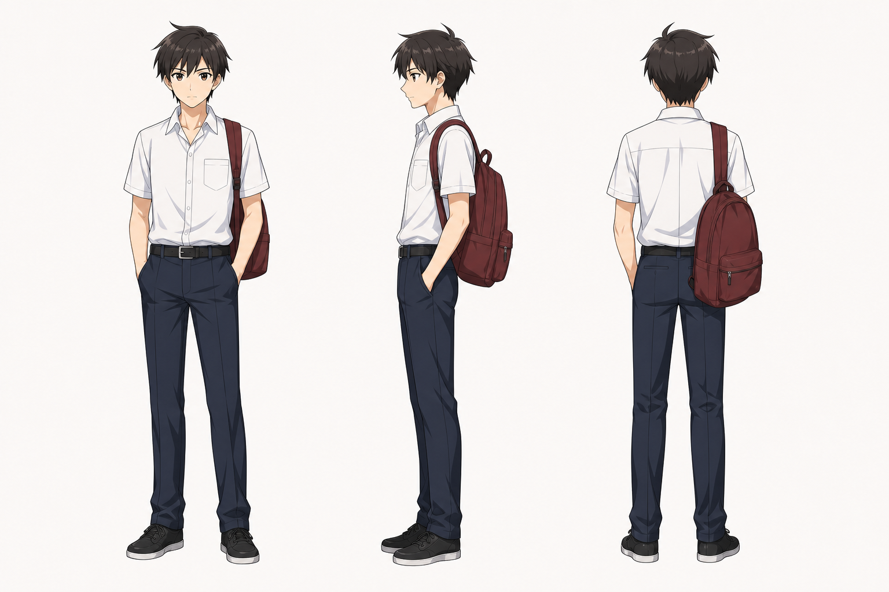

# 月 角色设定

## 三视图

- 状态：已生成。
- 风格参考：`Assets/lan_arashi_three_view.png`
- 目标图片：`Assets/yue_three_view_image2.png`
- Image-2 提示词：`Image2Prompts/yue_image2_prompt.txt`
- 批量生成脚本：`tools/generate_image2_turnarounds.py`

后续精修时建议分两版：

1. 少年/高中版：校服或日常短袖，书包，体态偏瘦，眼神有逞强和青涩感。
2. 成年版：简洁衬衫或通勤装，体态更稳，眼神更沉，能承接医院、工作和求婚段落。

三视图要求：

- 正面：普通站姿，肩背略紧，保留少年感。
- 侧面：显示偏瘦体态、校服或衬衫层次。
- 背面：书包、发型后轮廓、衣服褶皱要清楚。

## 基本信息

- 角色名：月 / 阿月
- 身份：男主，第一人称叙述者。
- 出身：大城市长大，母亲已故，父亲长期忙于工作、出差和值班。
- 叙事作用：通过回忆和当下经历串联童年、青春、成人责任和家庭。

## 角色核心

月的成长线从“冲动保护”走向“真正承担”。童年时他好动、调皮、逞强，遇到岚被欺负会直接冲上去打架。青春期后，他习惯把情绪压进学习和沉默里。成年后，他在岚患病、父亲点醒、求婚、创业和成家中逐渐理解责任的重量。

## 视觉关键词

- 城市少年、山镇暑假、二八大杠、自行车后座、书包、草稿纸、棋盘、医院、疲惫但坚定。
- 少年期应有明亮、好动、逞强的气质。
- 高中分离期可压低明度，强化疲惫眼神、凌乱头发、校服或衬衫褶皱。
- 成年期应更沉稳，轮廓更利落，可加入衬衫、工牌、会议室、棋盘等元素。

## 性格与行为

- 好动、调皮、嘴硬，内心有强烈保护欲。
- 常用吐槽和自嘲缓冲尴尬。
- 面对重大压力时容易沉默和自我消耗。
- 对岚的感情从童年依恋、青春恋爱，逐渐转为共同生活与责任。

## 常用表情

- 默认：略拘谨或沉默，眼神观察环境。
- 调皮：得意笑、挑眉、逞强。
- 害羞：视线偏开，嘴硬，耳根或脸颊微红。
- 压抑：眼神失焦，嘴角下压，黑眼圈或疲态。
- 崩溃：咬牙、怒吼、握拳、摔书。
- 成熟坚定：低调、专注、眼神稳定。

## 常用动作

- 骑二八大杠，拍后座示意岚上车。
- 冲到欺负者旁边挥拳，受伤后仍护着岚。
- 背岚下山，给岚揉脚踝，给她盖被子。
- 埋头刷题，揉成绩单，望向窗外。
- 成年后下象棋、开会、照顾住院的岚、求婚。

## 关键关系

- 与岚：青梅竹马、恋人、夫妻。
- 与老爸：父子，老爸是他理解责任的核心引导者。
- 与母亲：母亲早逝，是父亲遗憾和山镇故事的根。
