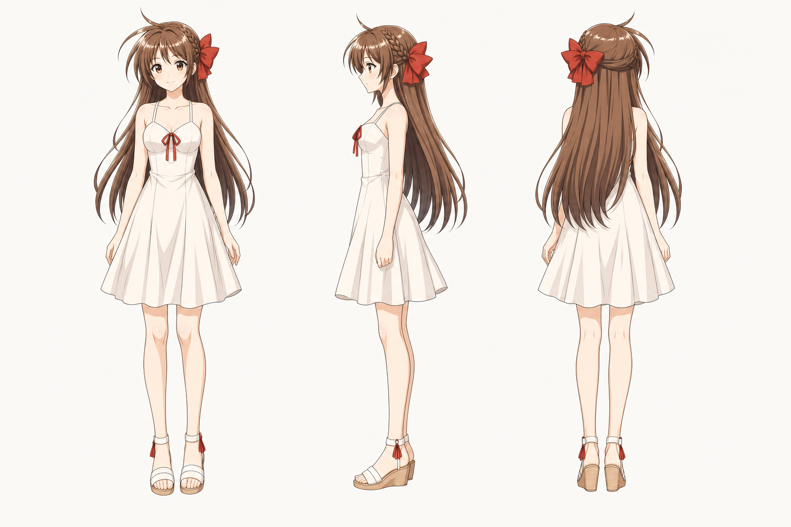

# 岚 / Lan / Arashi 角色设定

## 三视图

- 状态：已生成。
- 风格参考：当前三视图为后续角色生成的风格、排版和质量基准。
- 目标图片：`Assets/lan_arashi_three_view.png`
- Image-2 提示词：无，当前为落地参考图。

图片路径：`Assets/lan_arashi_three_view.png`

## 基本信息

- 中文名：岚
- 工程名：Lan / Arashi
- 身份：女主，月在母亲老家山镇遇见的女孩。
- 年龄关系：与月同年级，比月晚生三个月。
- 出身：小山镇女孩，父母常不在家，常由月的外公外婆照顾。
- 后期轨迹：努力考入城市高中，大学学习心理学，毕业后成为小学老师，与月结婚并育有龙凤胎。

## 角色核心

岚不是单纯被保护者。她童年怯生、乖巧、容易受欺负，但会主动亲近月，也会为了自己的未来努力考学。高中阶段她因成绩、人际和早恋压力主动提出暂时分手，本质是想保护两人的未来。成年后她能与月共同承担生活压力。

## 视觉关键词

- 白裙、红蝴蝶结、栗棕长发、右侧编发、白色凉鞋、夏风、星空、发香、清风感。
- 气质应是温柔、文艺、清澈，但眼神里要有韧性。
- 避免过度性感化，主视觉应更接近“盛夏里被风吹动的少女”。

## 外形设定

- 发色：温暖栗棕色，受光处有蜂蜜色高光。
- 发型：超长发，侧分碎刘海，右侧有细编发，右后侧佩戴大红蝴蝶结。
- 眼睛：暖棕到琥珀棕，眼型偏杏，默认眼神温柔。
- 服装：象牙白吊带连衣裙，胸前红色小结，裙摆轻盈。
- 鞋：白色踝带坡跟凉鞋，侧边有小红流苏，与发结和胸前结呼应。

## 常用表情

- 怯生：低头、视线躲闪，说话像“那个……”开头。
- 乖巧：双手放在身前，安静看着月。
- 害羞：脸红、鼓腮、避开视线。
- 委屈：眼眶含泪，脸通红。
- 温柔微笑：看月吃饭、病房照顾、求婚段落常用。
- 调皮腹黑：突然浅笑、拍月丑照、轻捶或掐肩。
- 坚强含泪：患病、复合、求婚、生产段落使用。

## 常用动作

- 掏水果糖、翻小说、咬发圈、梳头、侧头。
- 坐自行车后座，抓紧后座，靠在月背上。
- 主动亲吻、环住月的腰、十指相扣。
- 做饭、洗衣服、递蒸玉米、煲鸡汤。
- 操场跑步、挑灯夜读、拍脸让自己清醒。

## 三视图制作规范

当前三视图已落地。后续如需重绘或分层：

- 正面：保留温柔浅笑、胸前红结、白裙结构线和凉鞋红流苏。
- 侧面：清楚显示侧编发、右后侧红蝴蝶结、长发厚度、裙摆侧轮廓。
- 背面：红蝴蝶结和长发体积必须清楚，背部肩带与裙摆褶皱要可读。

## 关键关系

- 与月：青梅竹马、恋人、夫妻。
- 与外公外婆：长期被照顾者。
- 与山镇：共同记忆和情感根源。
