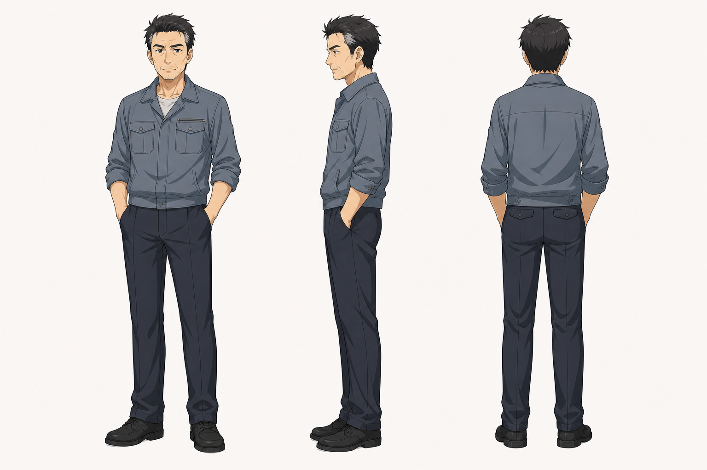

# 老爸 角色设定

## 三视图

- 状态：已生成。
- 风格参考：`Assets/lan_arashi_three_view.png`
- 目标图片：`Assets/father_three_view_image2.png`
- Image-2 提示词：`Image2Prompts/father_image2_prompt.txt`
- 批量生成脚本：`tools/generate_image2_turnarounds.py`

后续精修时建议：

- 正面：中年男性，肩背略宽但有疲态，简洁衬衫或夹克。
- 侧面：突出鼻梁、下颌、略驼或压低的肩线。
- 背面：外套褶皱、微乱短发、成熟背影。

建议制作两个阶段：

- 青年父亲版：更瘦、更冲动，可用于私奔与母亲回忆。
- 中年父亲版：主线使用，带银丝、烟、棋盘气质。

## 基本信息

- 角色名：老爸
- 身份：月的父亲，单亲父亲形象。
- 背景：年轻时与月的母亲相爱并私奔，后来因经济能力和规划不足，在妻子患病时留下巨大遗憾。
- 剧情作用：把月从青春冲动推向成人责任的人。

## 角色核心

老爸不是冷漠父亲。他表达笨拙、话少、粗粝，但关键时刻一直在观察并兜底。他用棋局、沉默、墓前往事和银行卡让月理解“喜欢”和“承担”之间的距离。

## 视觉关键词

- 沉默父亲、烟、棋盘、茶壶、旧书房、银丝、墓前、大城市打拼后的疲惫。
- 整体应有粗粝现实感，不要过度精英化。
- 成年后有明显岁月痕迹，头发可有银丝，眼神疲惫但清醒。

## 性格与行为

- 话不多，不喜欢解释太多。
- 关键时刻判断清楚，会用短句点醒月。
- 表达爱的方法偏行动：开车、给生活费、出钱治疗、带月去墓前。
- 对责任有强烈执念，源于年轻时失去爱人的遗憾。

## 常用表情

- 平静寡言：多数日常状态。
- 粗粝吐槽：如月打架住院后说“原来你没打过”。
- 叹气无奈：察觉月状态不对时。
- 严肃点醒：谈责任、谈岚、谈人生选择。
- 沧桑疲惫：讲母亲往事、墓前段落。
- 欣慰：月终于赢过他时。

## 常用动作

- 打开车门，扯月衣领叫醒。
- 出差、值夜班、钓鱼、拿生活费。
- 点烟、掐灭烟头、吐出白烟。
- 从桌底拿棋盘、摆棋子、泡茶。
- 墓前拨开杂草，递银行卡和存折。

## 关键关系

- 与月：父子，教育方式粗粝但关键时刻可靠。
- 与母亲：爱人，母亲的死亡构成他一生遗憾。
- 与岚：间接保护者，在岚患病时帮助治疗。
