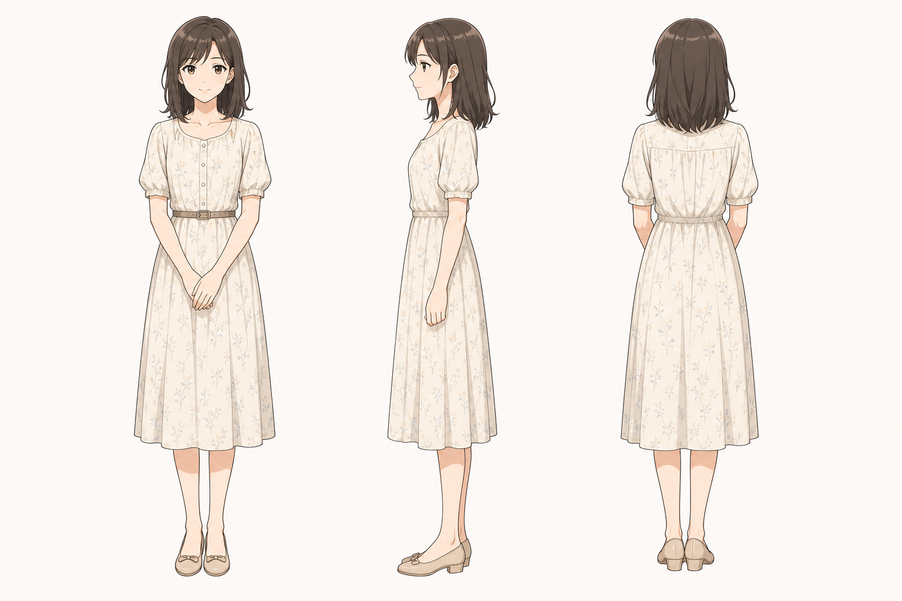

# 母亲 角色设定

## 三视图

- 状态：已生成。
- 风格参考：`Assets/lan_arashi_three_view.png`
- 目标图片：`Assets/mother_three_view_image2.png`
- Image-2 提示词：`Image2Prompts/mother_image2_prompt.txt`
- 批量生成脚本：`tools/generate_image2_turnarounds.py`

后续精修时建议：

- 正面：年轻女性，温柔但有主见，淡色连衣裙或朴素衬衫裙。
- 侧面：轮廓柔和，发型比岚更成熟简洁。
- 背面：能体现山镇出身和旧时代感的朴素服装。

建议版本：

- 年轻私奔版：主视觉用于老爸回忆。
- 病弱回忆版：谨慎使用，避免过度悲情化。

## 基本信息

- 角色名：母亲
- 身份：月已故的母亲，老爸深爱的人。
- 出身：来自小山镇或山镇一带。
- 剧情状态：主线开始前已去世，主要通过回忆、墓前叙述和山镇气息存在。

## 角色核心

母亲是故事中“遗憾”和“回到山镇”的根。她的死亡影响老爸的一生，也塑造了老爸对月的责任教育。她不宜被处理成单纯符号，应保留年轻时敢爱、愿意私奔、也曾真实生活过的质感。

## 视觉关键词

- 山镇出身、年轻私奔、温柔、旧照片、墓前大树、淡色衣裙、旧时代感。
- 视觉上可与岚有轻微呼应，但不能让两人看起来像同一人。
- 色彩应比岚更柔和、旧照片感更强。

## 性格与行为

- 年轻时敢于追随爱情，与老爸私奔。
- 温柔但不是没有主见。
- 她的缺席形成月和老爸之间长期沉默。

## 常用表情

- 旧照片中的浅笑。
- 回忆中的温柔注视。
- 病中疲惫但安静。
- 与老爸私奔阶段可有坚定、明亮的眼神。

## 常用动作

- 回忆中牵着年轻老爸的手。
- 坐在山镇小院或车站边。
- 病中靠在床头。
- 墓前段落不直接登场，可通过照片、风、草、树影表现。

## 关键关系

- 与老爸：爱人，年轻时私奔。
- 与月：母子，虽然缺席但影响月的人生开端。
- 与山镇：月和岚故事得以发生的入口。
