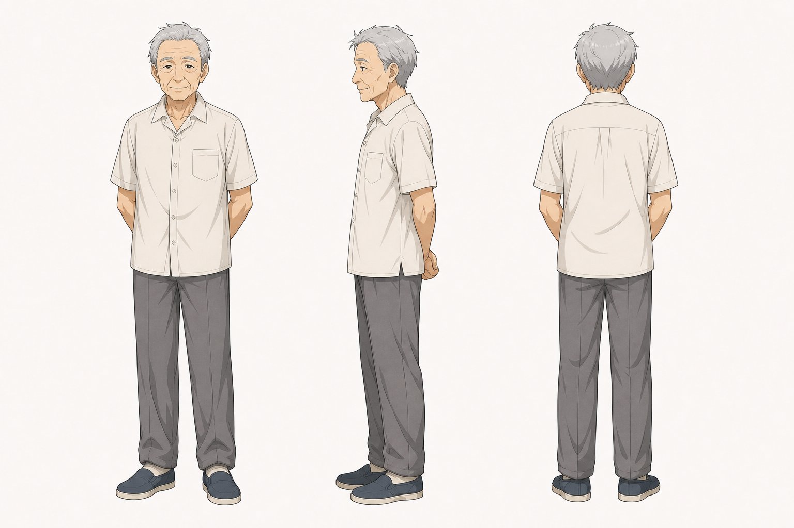
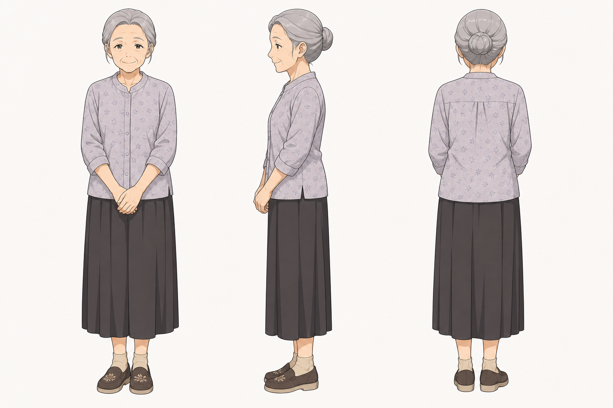

# 外公、外婆 角色设定

## 三视图

### 外公

- 状态：已生成。
- 风格参考：`Assets/lan_arashi_three_view.png`
- 目标图片：`Assets/grandfather_three_view_image2.png`
- Image-2 提示词：`Image2Prompts/grandfather_image2_prompt.txt`

### 外婆

- 状态：已生成。
- 风格参考：`Assets/lan_arashi_three_view.png`
- 目标图片：`Assets/grandmother_three_view_image2.png`
- Image-2 提示词：`Image2Prompts/grandmother_image2_prompt.txt`

批量生成脚本：`tools/generate_image2_turnarounds.py`

后续精修时建议：

外公：

- 正面：朴素短袖或汗衫，微驼背，慈祥。
- 侧面：鼻梁、下巴、肩背年龄感。
- 背面：老人背影，衣服宽松。

外婆：

- 正面：朴素衬衫或旧式短袖，围裙可选。
- 侧面：发髻或短发轮廓，体态温和。
- 背面：围裙绑带、发型后轮廓清楚。

## 基本信息

- 角色名：外公、外婆
- 身份：月母亲一方的老人，居住在小山镇。
- 剧情作用：接纳月回到母亲老家，照看岚，承载山镇慢生活和家庭温度。

## 角色核心

外公外婆代表山镇的日常温度。他们不是强剧情推动者，而是让月与岚能够相遇、生活、吃饭、散步和被照看的家庭背景。

## 视觉关键词

- 小院、藤椅、蒲扇、旧屋、木桶、风扇、夏夜、朴素老人。
- 造型应温和、生活化，避免仙风道骨或夸张喜剧老人。

## 性格与行为

- 慈祥、平静，对孩子们的相处多半宽容。
- 有山镇老人特有的慢节奏。
- 对岚有照顾者的亲近感，对月有外孙回家的包容感。

## 常用表情

- 慈祥微笑。
- 平静看护。
- 看年轻人笑闹时带“年轻真好”的笑。
- 管教时不严厉但有效。

## 常用动作

- 藤椅上摇蒲扇。
- 晚饭前后散步。
- 招呼孩子吃饭、洗脚、休息。
- 视频通话中插入聊天。

## 关键关系

- 与月：外孙与长辈。
- 与岚：照顾者与被照顾者。
- 与山镇：慢生活和家庭温度的具象化。
