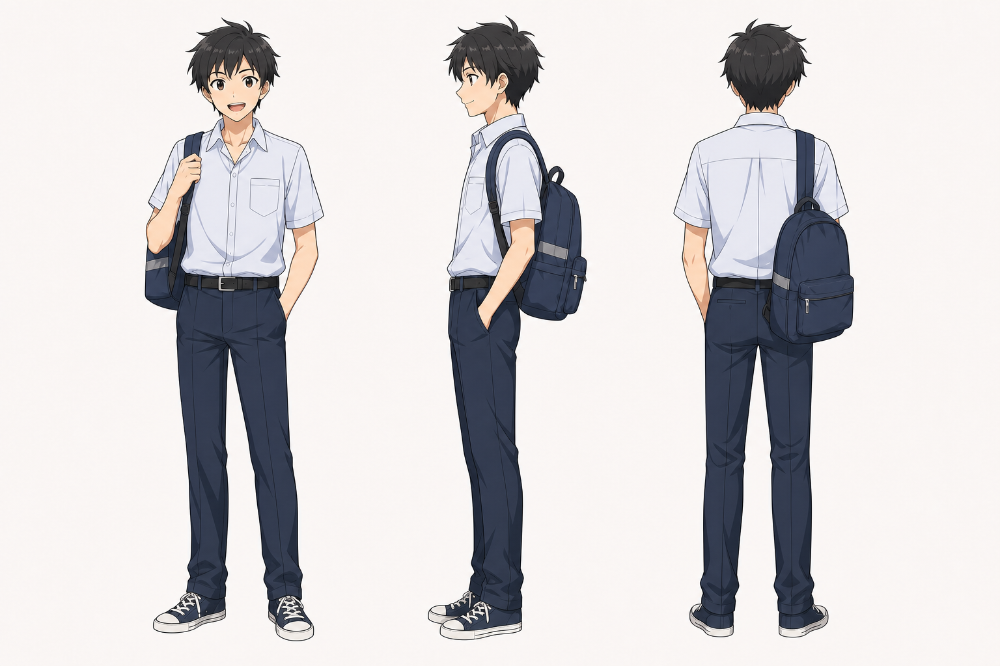

# 基友 角色设定

## 三视图

- 状态：已生成。
- 风格参考：`Assets/lan_arashi_three_view.png`
- 目标图片：`Assets/best_friend_three_view_image2.png`
- Image-2 提示词：`Image2Prompts/best_friend_image2_prompt.txt`
- 批量生成脚本：`tools/generate_image2_turnarounds.py`

后续精修时建议：

- 正面：高中男生，表情外放，校服或休闲装。
- 侧面：轻松站姿，身体略前倾，像在套话。
- 背面：书包、校服后摆、运动鞋。

建议成年版：

- 简洁通勤装或衬衫，手持资料/电脑包可作为立绘变体。

## 基本信息

- 角色名：基友
- 身份：月在学校中少数经常交流的同学和朋友。
- 轨迹：初中、高中都与月有交集，中考后与月进入同一所较好的高中。
- 成年作用：月创业时找他帮忙，依靠其经济学背景分析创业方案。

## 角色核心

基友承担校园轻喜剧缓冲，也在高二分离期成为月情绪爆发的触发点。成年后，他从八卦同学转为能提供现实帮助的朋友。

## 视觉关键词

- 校园朋友、八卦、吐槽、同桌或后排、书包、运动鞋、成年后经济学/创业参谋。
- 视觉上应比月更外放，更容易做夸张表情。

## 性格与行为

- 爱八卦，喜欢调侃月和岚。
- 会震惊、抱头吐槽，也会担心月。
- 情绪表达比月更直接。
- 成年后变得实用，能帮月分析创业方案。

## 常用表情

- 八卦笑。
- 震惊张嘴。
- 不甘和尴尬。
- 担心、试探性关心。

## 常用动作

- 侧身单手撑头套话。
- 拍月肩膀。
- 抱头吐槽。
- 想道歉但不知道怎么开口。
- 成年后看方案、翻资料、讨论数字。

## 关键关系

- 与月：同学、朋友、后期创业伙伴。
- 与岚：主要通过调侃月和岚关系产生喜剧作用。
