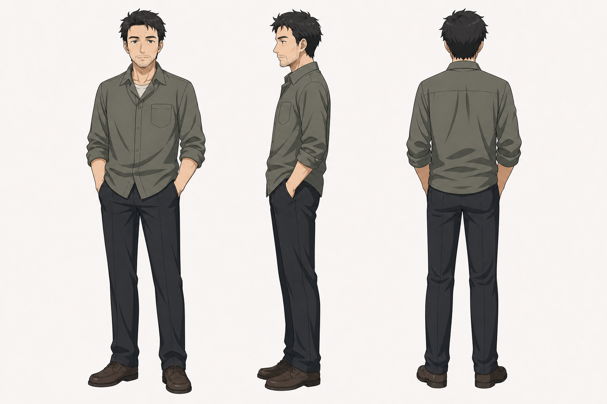

# 阿sir 角色设定

## 三视图

- 状态：已生成。
- 风格参考：`Assets/lan_arashi_three_view.png`
- 目标图片：`Assets/asir_three_view_image2.png`
- Image-2 提示词：`Image2Prompts/asir_image2_prompt.txt`
- 批量生成脚本：`tools/generate_image2_turnarounds.py`

后续精修时建议：

- 正面：中青年或中年男性，休闲衬衫，姿态松散。
- 侧面：可有胡茬或疲态，体现书屋老板的随意。
- 背面：衬衫、拖鞋或旧运动鞋，整体生活化。

可选配件：

- 猫、旧影碟、书本、遥控器。

## 基本信息

- 角色名：阿sir
- 身份：小镇书屋老板。
- 特征：喜欢港片警匪剧，沉默寡言，喜欢和小孩相处，养了一只猫。
- 剧情作用：提供小镇书屋这个童年和暑假活动空间，补足年代感和安静氛围。

## 角色核心

阿sir是山镇记忆中的守望者式背景人物。他不需要强戏剧性，但要让书屋显得真实、安静、有年代感。

## 视觉关键词

- 小镇书屋、漫画、影碟、旧电视、猫、港片、沉默老板。
- 造型可以略带港片爱好者气质，但不要变成警察或黑帮。

## 性格与行为

- 沉默，不爱多说。
- 对孩子们宽容，但会提醒别乱摸猫。
- 像书屋和小镇记忆的一部分，存在感稳定。

## 常用表情

- 沉默。
- 无奈。
- 平静守望。
- 对孩子轻微纵容的淡笑。

## 常用动作

- 放猫粮。
- 看港片警匪剧。
- 整理书架、影碟。
- 提醒月别乱摸猫。

## 关键关系

- 与月和岚：小镇童年活动空间的提供者。
- 与书屋：角色几乎和场景绑定。
