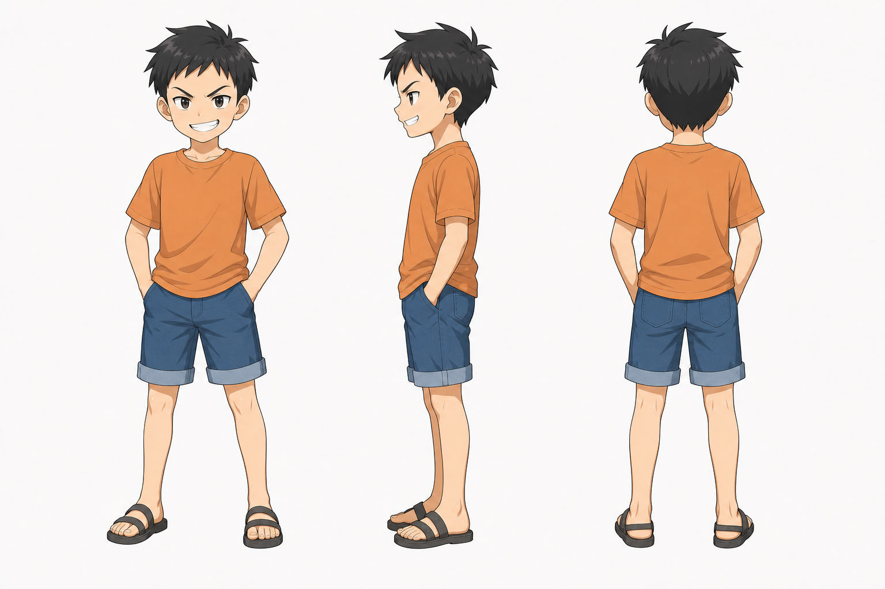
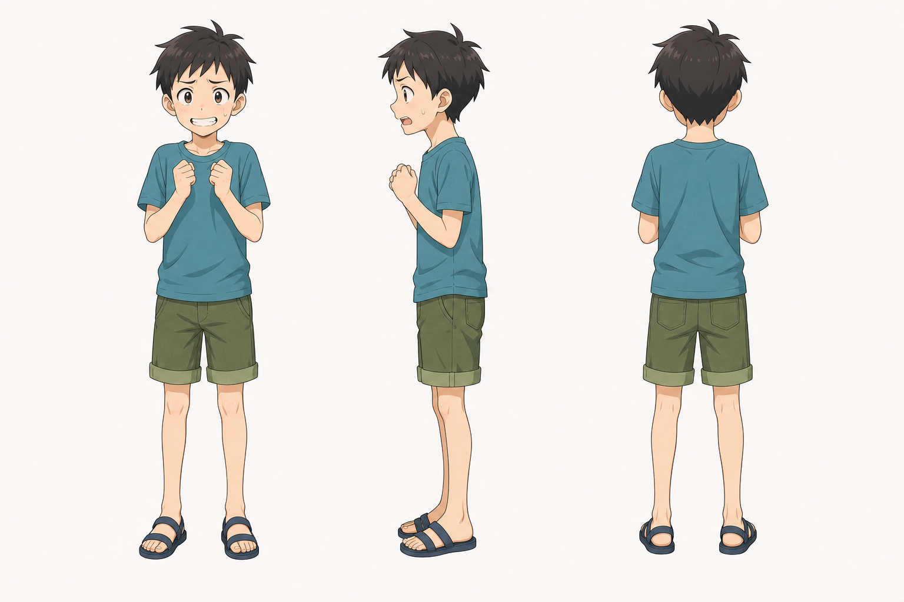
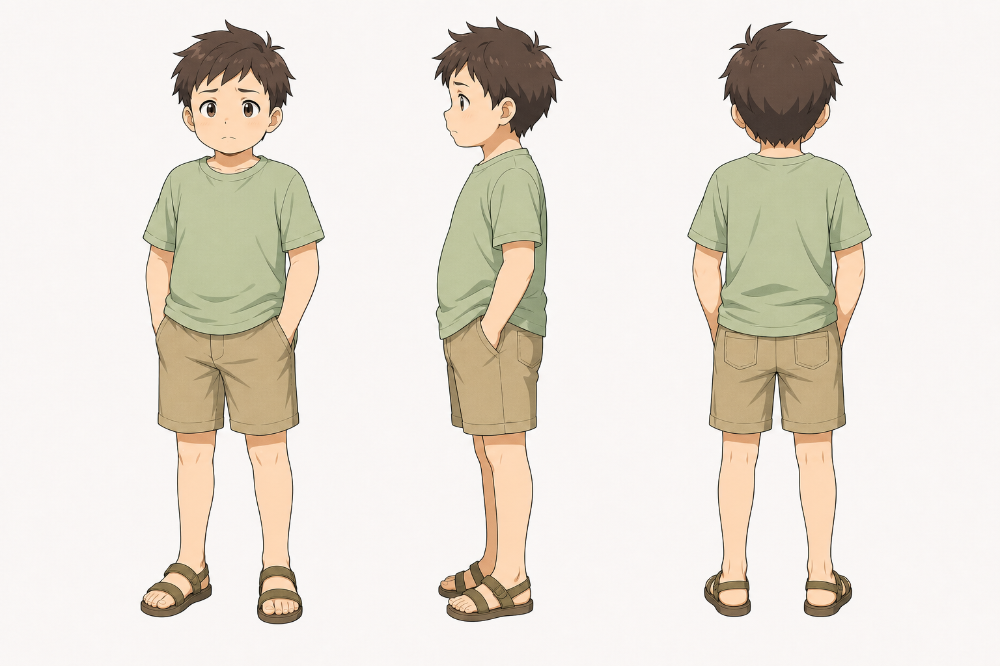

# 镇上孩子 / 欺负岚的三人 角色设定

## 三视图

### 领头孩子

- 状态：已生成。
- 风格参考：`Assets/lan_arashi_three_view.png`
- 目标图片：`Assets/town_child_leader_three_view_image2.png`
- Image-2 提示词：`Image2Prompts/town_child_leader_image2_prompt.txt`

### 跟风孩子 A

- 状态：已生成。
- 风格参考：`Assets/lan_arashi_three_view.png`
- 目标图片：`Assets/town_child_a_three_view_image2.png`
- Image-2 提示词：`Image2Prompts/town_child_a_image2_prompt.txt`

### 跟风孩子 B

- 状态：已生成。
- 风格参考：`Assets/lan_arashi_three_view.png`
- 目标图片：`Assets/town_child_b_three_view_image2.png`
- Image-2 提示词：`Image2Prompts/town_child_b_image2_prompt.txt`

批量生成脚本：`tools/generate_image2_turnarounds.py`

后续精修时建议：

1. 领头孩子：更高一点，表情嚣张，短发，卷裤脚。
2. 跟风孩子 A：瘦小，动作夸张。
3. 跟风孩子 B：更犹豫，表情容易慌。

三视图要求：

- 正面：年龄感必须是儿童或少年，不要成年化。
- 侧面：溪水玩耍姿态可作为动作参考，但三视图保持站直。
- 背面：短袖、短裤、凉鞋、湿衣摆等细节可读。

## 基本信息

- 角色组：镇上孩子 / 欺负岚的三人
- 身份：童年山溪玩水时欺负岚的小孩群体。
- 行为：称岚为“女魔头”，向岚泼水，导致月冲上去打架。
- 剧情作用：触发月第一次强烈保护岚的事件，也让岚对月产生更深依赖和安全感。

## 角色核心

他们是童年冲突的引信，不宜塑造成纯粹恶人。更适合表现为熟人社会里无知、嘴碎、从众欺负人的孩子。

## 视觉关键词

- 山溪、湿衣服、卷裤脚、短袖、凉鞋、调皮、起哄。
- 造型要有小镇孩子的粗糙生活感。

## 性格与行为

- 起哄、嘴碎、从众。
- 面对弱势者会欺负，面对反击会慌张。
- 领头者更嚣张，另外两人更偏跟风。

## 常用表情

- 嘲笑。
- 挑衅。
- 惊讶。
- 被月冲上来时的慌乱。

## 常用动作

- 泼水。
- 指着岚起哄。
- 卷裤脚站在溪水里。
- 打架时后退或围上来。

## 关键关系

- 与岚：童年欺负者。
- 与月：触发月保护欲和打架事件。
