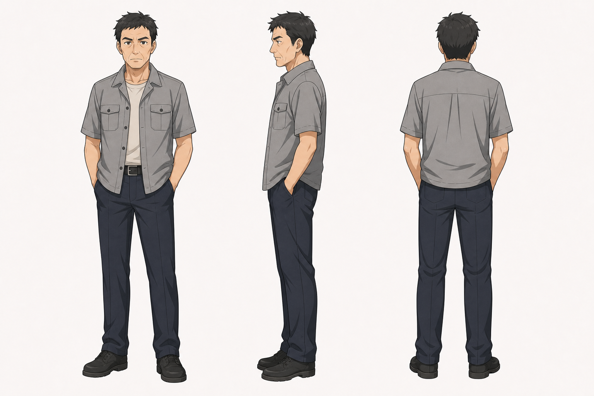
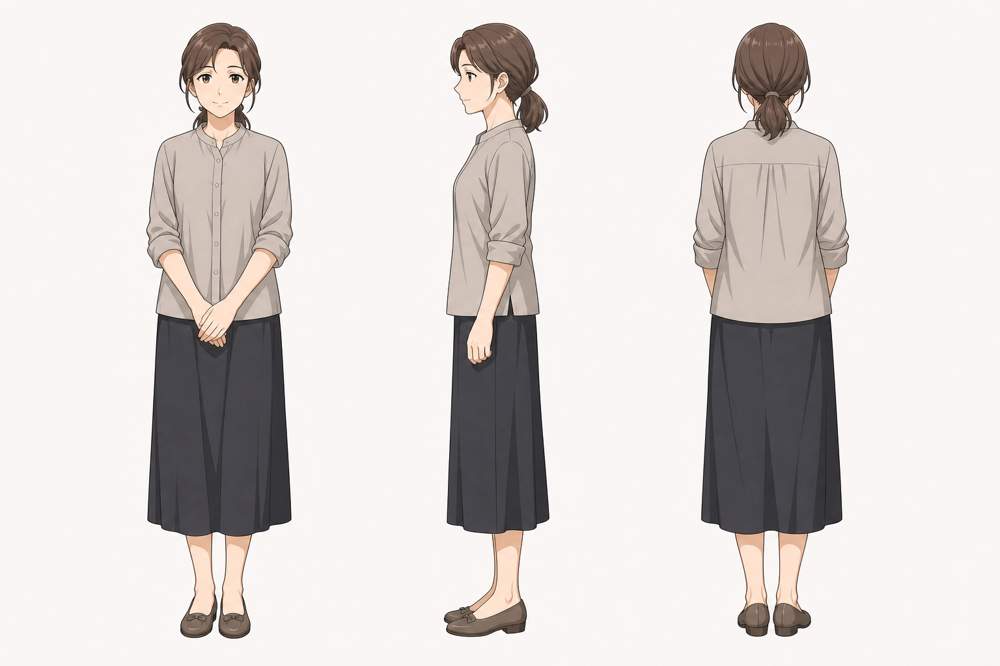

# 岚的父母 角色设定

## 三视图

### 岚父

- 状态：已生成。
- 风格参考：`Assets/lan_arashi_three_view.png`
- 目标图片：`Assets/lan_father_three_view_image2.png`
- Image-2 提示词：`Image2Prompts/lan_father_image2_prompt.txt`

### 岚母

- 状态：已生成。
- 风格参考：`Assets/lan_arashi_three_view.png`
- 目标图片：`Assets/lan_mother_three_view_image2.png`
- Image-2 提示词：`Image2Prompts/lan_mother_image2_prompt.txt`

批量生成脚本：`tools/generate_image2_turnarounds.py`

后续精修时建议：

岚父：

- 正面：中年男性，朴素夹克或短袖，表情稳重。
- 侧面：脸部线条略硬，体现生活压力。
- 背面：普通山镇中年男性背影。

岚母：

- 正面：中年女性，朴素上衣或衬衫，表情温和但有距离感。
- 侧面：发型简洁，体态生活化。
- 背面：衣着整洁但不精致。

## 基本信息

- 角色组：岚的父母
- 身份：岚的父母，长期不在家。
- 剧情作用：解释岚为何常由外公外婆照顾；成年后月和岚回山镇说明关系时，接受月这个女婿。

## 角色核心

岚的父母是背景型家庭角色。他们不应被简单处理成恶意缺席，而应表现为现实生活中因为工作、压力或家庭安排导致陪伴不足的父母。

## 视觉关键词

- 山镇家庭、长期奔波、朴素衣着、成年后见女婿、现实生活压力。
- 造型应生活化，和外公外婆相比更年轻但同样朴素。

## 性格与行为

- 长期不在家，导致岚早年缺少稳定陪伴。
- 成年后能够接受月与岚的关系。
- 与岚之间可有距离感，但不必强化冲突。

## 常用表情

- 平静。
- 尴尬或歉疚。
- 见月时的审视。
- 接受关系后的缓和。

## 常用动作

- 饭桌上听月和岚说明关系。
- 收拾行李或从外地回来。
- 与岚短暂寒暄。
- 婚礼前后与长辈交谈。

## 关键关系

- 与岚：父母与女儿，陪伴不足但最终接纳她的选择。
- 与月：成年后接受月作为女婿。
