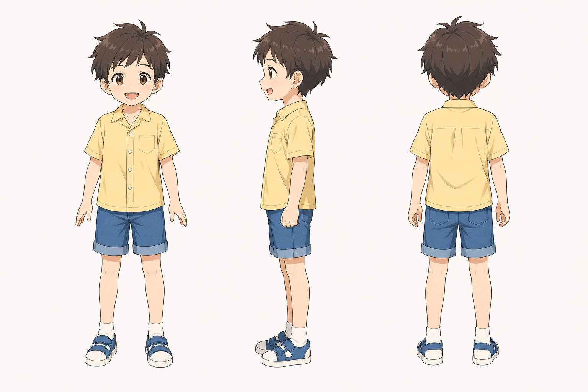
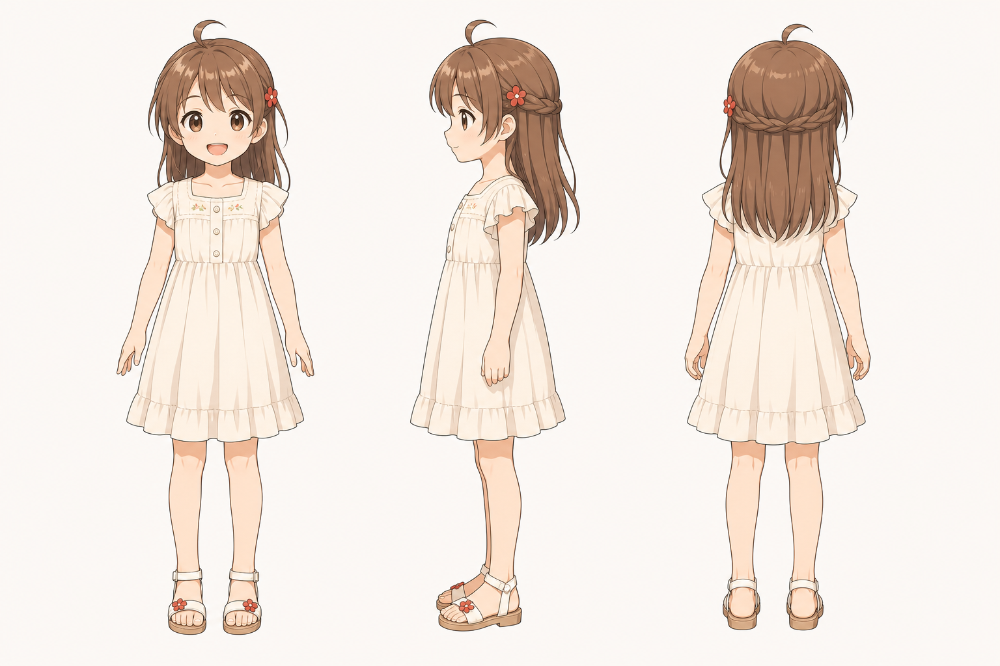

# 月与岚的孩子 角色设定

## 三视图

### 儿子

- 状态：已生成。
- 风格参考：`Assets/lan_arashi_three_view.png`
- 目标图片：`Assets/son_three_view_image2.png`
- Image-2 提示词：`Image2Prompts/son_image2_prompt.txt`

### 女儿

- 状态：已生成。
- 风格参考：`Assets/lan_arashi_three_view.png`
- 目标图片：`Assets/daughter_three_view_image2.png`
- Image-2 提示词：`Image2Prompts/daughter_image2_prompt.txt`

批量生成脚本：`tools/generate_image2_turnarounds.py`

后续精修时建议分别制作男孩和女孩：

男孩：

- 正面：夏日短袖短裤，活泼站姿。
- 侧面：能看出好动和轻快。
- 背面：小背包或运动鞋细节。

女孩：

- 正面：浅色夏裙，可带小红发饰呼应岚。
- 侧面：发型和裙摆清楚。
- 背面：发饰、裙摆和童年感要明确。

## 基本信息

- 角色组：月与岚的孩子
- 身份：月和岚婚后的龙凤胎。
- 剧情作用：十年后尾声中，一家人回到小山镇，孩子们听父母讲过去，让“盛夏的风”形成代际延续。

## 角色核心

孩子们是结尾的回环象征。他们不需要承担复杂主线，而是让月与岚的故事从青春恋爱落到家庭与下一代。

## 视觉关键词

- 龙凤胎、小山镇、盛夏夕阳、旧路、听父母讲过去、孩子骑车呼应童年。
- 设计上可从月和岚各继承部分特征。

## 外形方向

男孩：

- 可继承月的活泼、好奇和调皮感。
- 发色可偏深棕，眼神更明亮。
- 服装适合夏日短袖、短裤、运动鞋。

女孩：

- 可继承岚的温柔眼神、栗棕发色或红色小发饰。
- 服装可用浅色夏裙或短袖裙装。
- 气质比岚童年更开朗，因为成长环境更完整。

## 常用表情

- 好奇。
- 听故事时睁大眼睛。
- 争着提问。
- 夕阳下开心奔跑。

## 常用动作

- 拉着父母的手。
- 沿旧路散步。
- 听父母讲过去。
- 看见骑车载女孩的小男孩时回头。

## 关键关系

- 与月、岚：子女。
- 与山镇：下一代重新进入父母共同记忆的场所。
